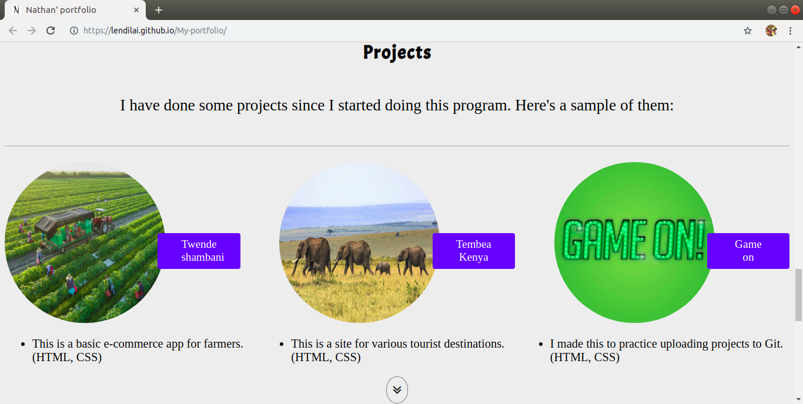

# 
#### {A simple portfolio}, {19.04.2019 version 1.0}
#### By **{Nathan Ng'ethe}**
## Description
{ A simple portfolio about myself and my life so far in coding. It includes my hobbies as well as projects I have done so far. I added double arrows to make it easier to scroll. I also added links to the projects for those who would like to view them. The website is also quite responsive on most devices.}

## Hobbies section

## projects

## Setup
{ The portfolio is only available for online access thus is sadly not available for installation.}

## Known Bugs
{ There are no known bugs so far. However, you can reach out to me if you come across any.}

## Technologies used

- [HTML](https://www.w3schools.com/htmL/html_intro.asp) - I used HTML to add text, images etc. I also used it to link some files. Basically, it acted as the backbone to my portfolio.
- [CSS](https://www.w3schools.com/css/) - this helped a great deal in adding animations, responsive design, and general styling. I also used it to add a background-image and fit the images as they were supposed to.

## Support and contact details
{ I highly encourage any recommendations and advice on how I can improve the portfolio. My contact details can be found in the portfolio. If you find any bugs on the website, you can contact me using the same contacts.}
